# 🚀 Cloud DevOps End-to-End Pipeline: The Ultimate Guide

## Project Overview

This project demonstrates a complete CI/CD pipeline for a Java web application, featuring infrastructure provisioning, containerization, Kubernetes deployment, and GitOps automation, showcasing how to streamline and standardize the application lifecycle using modern DevOps practices.


## 🌟 **Project Showcase**
A DevOps pipeline featuring:

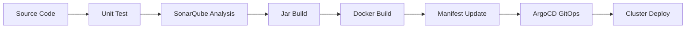

## 🧰 Tools Used

- **Terraform** – Infrastructure provisioning
- **Ansible** – Configuration management
- **Jenkins** – CI/CD orchestration
- **SonarQube** – Static code analysis
- **Docker** – Containerization
- **Kubernetes (K8s)** – Container orchestration
- **Argo CD** – GitOps continuous delivery

## ⚙️ Pipeline Workflow

1. **Infrastructure Provisioning**  
   Using **Terraform**, an EC2 instance is provisioned on AWS to serve as the Jenkins master/agent and SonarQube servers.

2. **Configuration Management**  
   **Ansible** is used to:
   - Install and configure Jenkins.
   - Set up Docker and other dependencies.

3. **CI/CD with Jenkins**
   - Jenkins is configured with a **freestyle project**.
   - A webhook is triggered by a **GitHub push event**, initiating the pipeline.

4. **Code Quality Check**
   - The pipeline runs **SonarQube** to perform static code analysis.

5. **Dockerization**
   - The application is containerized using a **Dockerfile**.
   - The image is pushed to **DockerHub**.

6. **Kubernetes Deployment**
   - A **Kubernetes cluster** (Minikube or remote) pulls the image.
   - Deployment manifests are applied to deploy the app.

7. **GitOps with Argo CD**
   - **Argo CD** continuously monitors the GitHub repository for changes in the manifests and applies them to the Kubernetes cluster automatically.

## 🔧 Requirements

- AWS CLI configured
- Terraform installed
- Ansible installed
- Jenkins and SonarQube (locally or remote)
- Docker.io & DockerHub account
- Kubectl & Kubernetes cluster (e.g., Minikube, k3s, or EKS)
- Argo CD configured
- Java-17-JDK

## ✅ Outcomes

- Seamless automated infrastructure provisioning and configuration
- Push-to-deploy CI/CD pipeline with integrated static code analysis
- GitOps-based deployment to Kubernetes using Argo CD

## Let's Setup the enviroment using **Infrastructure Automation**

### 🌐 Infrastructure Provisioning with **Terraform **
Let's create a script for a VPC, Subnet, Security Groups and 3 EC2 instances for application devlivery and deployment.

#### Setup S3 Terraform Backend state to store the tfstate file

Use the attach script to automate the S3 bucket creation but before that make sure you configured aws cli with the right access keys

```sh 
chmod +x setup-s3.sh
./setup-s3.sh <bucket-name> <region> <aws-profile>
```
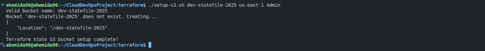
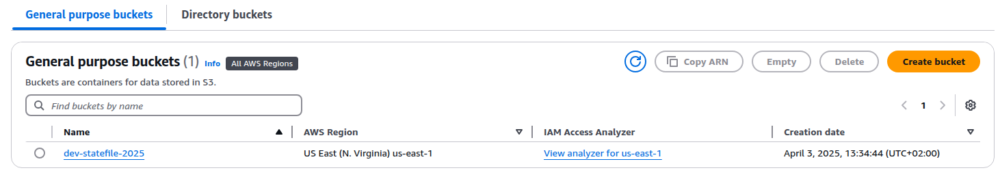

#### Setup terraform 
Use the attached script to automate the installation for terraform

```sh
chmod +x setup-terraform.sh
./setup-terraform.sh
```

#### Configure AWS and Ansible providers and S3 backend
Create a provifer.tf file and add the required plugins, for our case: aws, local, tls, ansible

```h
terraform {
  required_providers {
    aws = {
      source  = "hashicorp/aws",
      version = "~> 5.0"
    }
    ansible = {
      source = "ansible/ansible"
      # version = "1.2.0"
    }
  }
  backend "s3" {
    bucket         = "bucket-name"    # Replace with your bucket name
    key            = "terraform.tfstate"   # Replace with your state file name
    region         = "us-east-1"      # Replace with your bucket region
    use_lockfile   = true         # To enable locking for the state file in the S3 bucket
  }
}

provider "aws" {
  region = "us-east-1"
  profile = "profile-name"
}
```
#### Create 2 modules (network and server) to easy reuse and modify
Here's the files structure for the terraform scripts and modules.

```text
── terraform/
│   ├── main.tf
│   ├── provider.tf
│   ├── setup-s3.sh
│   ├── setup-terraform.sh
│   ├── variables.tf
│   ├── .terraform/
│   ├── modules/
│   │   ├── network/
│   │   │   ├── main.tf
│   │   │   ├── outputs.tf
│   │   │   └── variables.tf
│   │   ├── server/
│   │   │   ├── main.tf
│   │   │   ├── outputs.tf
│   │   │   └── variables.tf
```
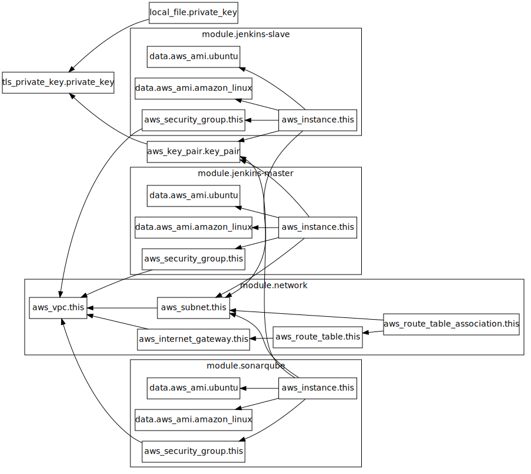

#### Initialize and Validate the terraform scripts and modules

Use `init` and `validate` to check that everything works and there's no typo.
```sh
terraform init && terraform validate
```
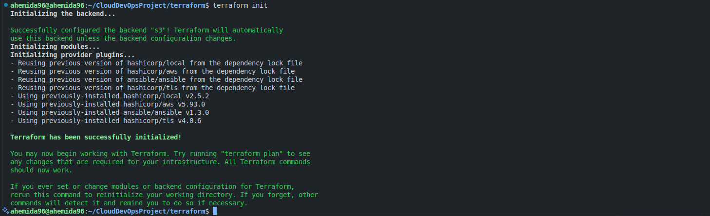

#### Now We are ready to apply the script to the cloud.

Use `apply` to start provision the infrastructure.
```sh
terraform apply -auto-approve
```
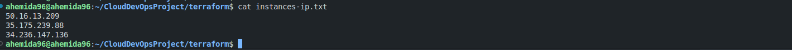
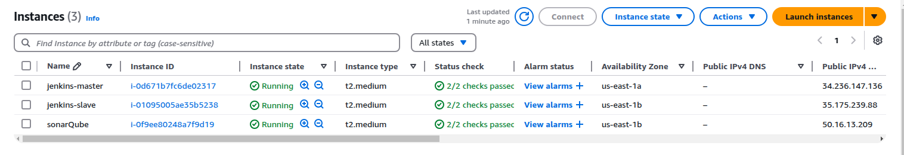
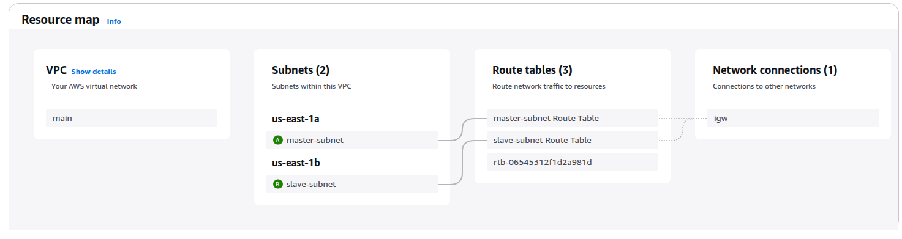
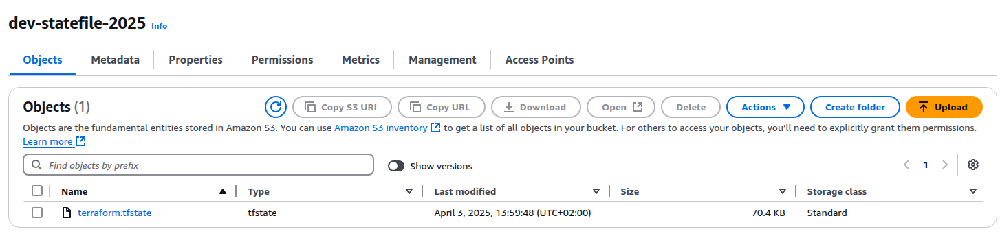
---

### Move on to setup our infrastructure configurations uing Ansbile tool

- Create roles files structure using `ansible-galaxy`
```sh
cd ansible
mkdir roles && cd roles
ansible-galaxy init <role-name>
```

- Make a dynamic inventory, we need to install aws collection:
```sh
ansible-galaxy collection install amazon.aws
```
To Test Dynamic Inventory: ```ansible-inventory -i inventories/ec2.yml --graph```
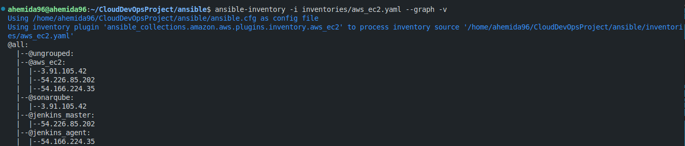

### 📁 **Ansible** Dir Structure:

```text
├── ansible/
│   ├── ansible.cfg
│   ├── group_vars/
│   │   ├── all.yaml
│   │   ├── jenkins_agent.yaml
│   │   ├── jenkins_master.yaml
│   │   └── sonarqube.yaml
│   ├── inventories/
│   │   └── aws_ec2.yaml
│   ├── playbooks/
│   │   ├── all.yaml
│   │   ├── jenkins_agent.yaml
│   │   ├── jenkins_master.yaml
│   │   ├── sonarqube.yaml
│   │   ├── roles/
│   │   │   ├── base/
│   │   │   │   ├── tasks/
│   │   │   │   │   └── main.yml
│   │   │   │   ├── vars/
│   │   │   │   │   └── main.yml
│   │   │   ├── jenkins-agent/
│   │   │   │   ├── tasks/
│   │   │   │   │   └── main.yml
│   │   │   │   ├── vars/
│   │   │   │   │   └── main.yml
│   │   │   ├── jenkins-master/
│   │   │   │   ├── tasks/
│   │   │   │   │   └── main.yml
│   │   │   │   ├── vars/
│   │   │   │   │   └── main.yml
│   │   │   ├── sonarqube/
│   │   │   │   ├── tasks/
│   │   │   │   │   └── main.yml
│   │   │   │   ├── vars/
│   │   │   │   │   └── main.yml
```

This directory contains everything needed to manage infrastructure and configure services (like Jenkins and SonarQube) using **Ansible**.

##### 🔹 `ansible.cfg`
- Configuration file for Ansible.
- Specifies settings like inventory location, default module paths, remote user, etc.

#### 🔹 `group_vars/`
- Holds variables associated with groups of hosts defined in the inventory.
- Organized by group names.

#### Files:
- `all.yaml`: Variables applied to **all hosts**.
- `jenkins_agent.yaml`: Variables specific to the **Jenkins agent** group.
- `jenkins_master.yaml`: Variables specific to the **Jenkins master** group.
- `sonarqube.yaml`: Variables for **SonarQube** setup.

#### 🔹 `inventories/`
- Contains the dynamic or static inventory files.

#### Files:
- `aws_ec2.yaml`: the **inventory file** that defines which AWS EC2 hosts are part of which groups (e.g., Jenkins master, agents, SonarQube).
  - This is dynamic ( using EC2 plugin).

#### 🔹 `playbooks/`
- Main entry point for automation tasks. Contains YAML playbooks that define what actions to run and on which hosts.

#### Files:
- `all.yaml`: a **master playbook** to include and orchestrate other playbooks.
- `jenkins_master.yaml`: Playbook to configure the **Jenkins master**.
- `jenkins_agent.yaml`: Playbook to configure **Jenkins agents**.
- `sonarqube.yaml`: Playbook to install and configure **SonarQube**.

#### 🔹 `roles/`
- Reusable and modular automation tasks organized into **roles**.

Each role contains:
- `tasks/main.yml`: Main automation tasks.
- `vars/main.yml`: Role-specific variables (credentials, paths, ports, etc.).

#### Roles:
- `base/`: Common setup tasks for all servers ( installing updates, git, doocker.io).
- `jenkins-master/`: Tasks and variables for setting up Jenkins master node.
- `jenkins-agent/`: Tasks and variables for configuring Jenkins worker nodes.
- `sonarqube/`: Installation and configuration of SonarQube.

---

## Moving to our java application

### Test and build the app
In order to deploy a java spring app we need to test and build it, to ensure it works.

1. **Clone the jave application**
```sh
git clone https://github.com/IbrahimAdell/FinalProjectCode.git
```
2. **Change mode of the gradlew**
```sh
cd web-app
chmod +x gradlew
```

3. **Install dependencies and requirements**
```sh
./gradlew tasks
```

4. **Run unit test**
```sh
./gradlew tests
```
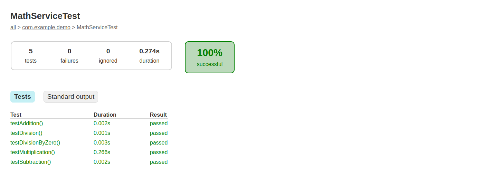

5. **Build The application**
```sh
./gradlew build
chmod +x  build/libs/demo-0.0.1-SNAPSHOT.jar
```

6. **Test with SonarQube**

    Install SonarQube: [Here](https://docs.sonarsource.com/sonarqube-server/latest/try-out-sonarqube/)

    I've used sonarqube as a docker container

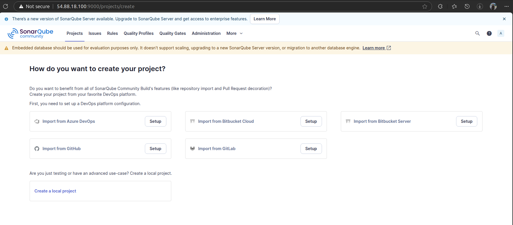

```sh
./gradlew build
```

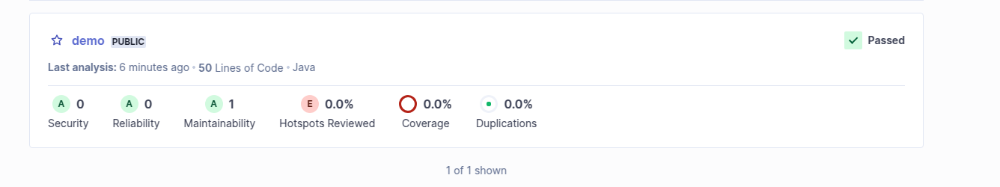

Let's run the application:
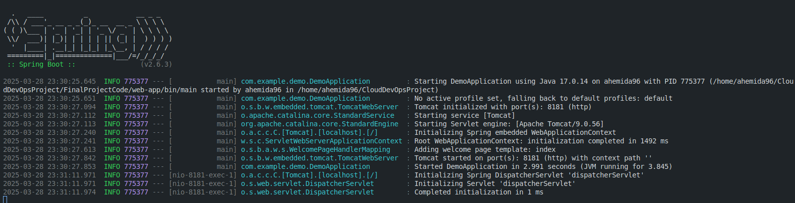
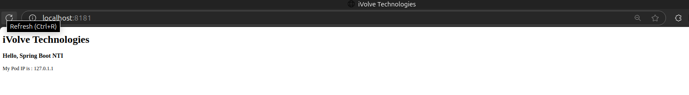

### 🐳 Decorize the app
- **Create Dockerfile to containrize it:**
```dockerfile
# 🏗️ Builder Stage
FROM gradle:7.6.1-jdk17-alpine AS builder
WORKDIR /app
# Copy Gradle configs (for caching)
COPY build.gradle gradlew settings.gradle ./
COPY gradle ./gradle
# Download dependencies (cached unless build.gradle changes)
RUN ./gradlew dependencies --no-daemon
# RUN chmod +x gradlew
COPY src ./src
RUN ./gradlew build --no-daemon

# 🚀 Runtime Stage
FROM eclipse-temurin:17-jre-alpine
# Set the working directory
WORKDIR /app
# Copy the built JAR file
COPY --from=builder /app/build/libs/demo-0.0.1-SNAPSHOT.jar app.jar 
# Expose port
EXPOSE 8081
# Run the application
CMD ["java", "-jar", "app.jar"]
```

- 📦 **Build & Push:**
```bash
docker build -t ivolve-app:${BUILD_ID} .
docker tag ivolve-app:${BUILD_ID} <registry.username>/ivolve-app:${BUILD_ID}
docker push <registry.username>/ivolve-app:${BUILD_ID}
```

- **Run container:**
```sh
docker run -d -p 8081:8081 <registry.username>/ivolve-app
```

- Verify container is working.

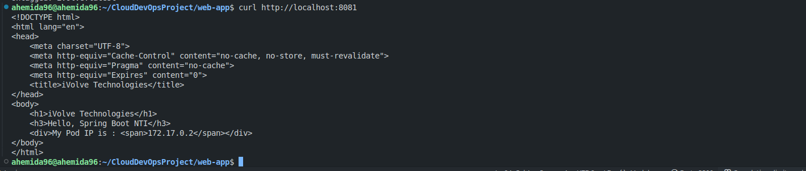


## Let's move on to deploy on kubernetes cluster
prerequisits:
- kubectl
- running cluster (e.g. minikube)
- java app image ready

steps:

1. start with set up ingress controller on minikube
```sh
minikube addons enable ingress
```
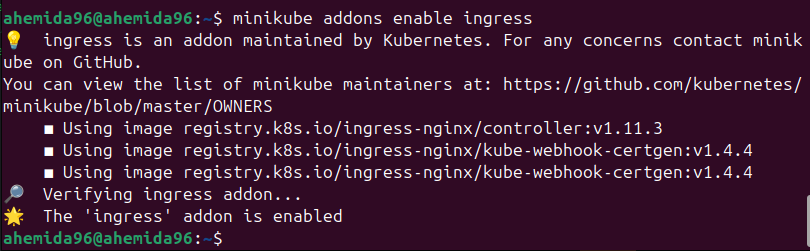
verify that the Ingress Controller is running

2. 
    - create a namespace defenation file [namespace.yaml](https://github.com/Ahemida96/CloudDevOpsProject/blob/master/k8s/namespace.yaml)
    - Create a deployment [deployment.yaml](https://github.com/Ahemida96/CloudDevOpsProject/blob/master/k8s/deployment.yaml)
    - create a service [service.yaml](https://github.com/Ahemida96/CloudDevOpsProject/blob/master/k8s/service.yaml)
    - Create ingress [ingress.yaml](https://github.com/Ahemida96/CloudDevOpsProject/blob/master/k8s/ingress.yaml)

3. Verify the nginx controller
```sh
kubectl get pods -n ingress-nginx
```
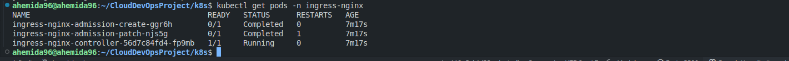

4. Apply all components

```sh
kubectl apply -f namespace.yaml
kubectl apply -f service.yaml
kubectl apply -f ingress.yaml
kubectl apply -f deployment.yaml
```
OR You can go to the dir and run:
```sh
cd k8s
kubectl apply -f .
```

5. Verify the IP address is set
```sh
kubectl get ingress
```
You should see an IPv4 address in the ADDRESS column;
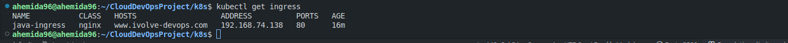

6. Verify that the Ingress controller is directing traffic
```sh
curl --resolve "ivolve-devops.com:8081:$( minikube ip )" -i http://hello-world.example
```

you can also visit hello-world.example from your browser.
Add a line to the bottom of the /etc/hosts file on your computer (you will need administrator access):

7. Look up the external IP address as reported by minikube
```sh
minikube ip
```
8. Add the following record to hosts file
```txt
minikube-ip domain-name
```

9. Verify all components are present and work fine

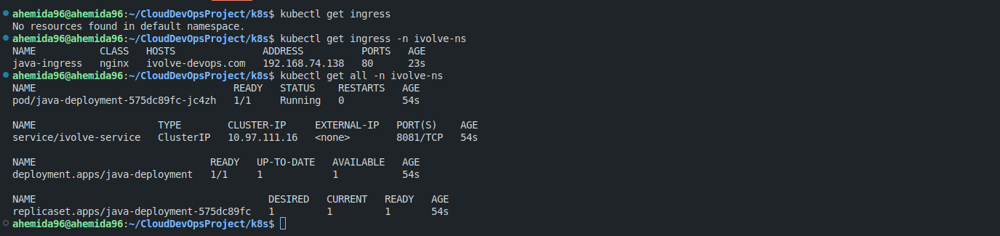
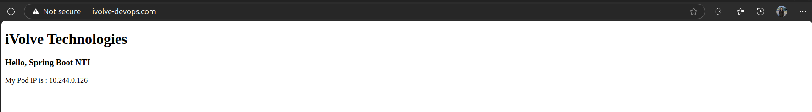

---